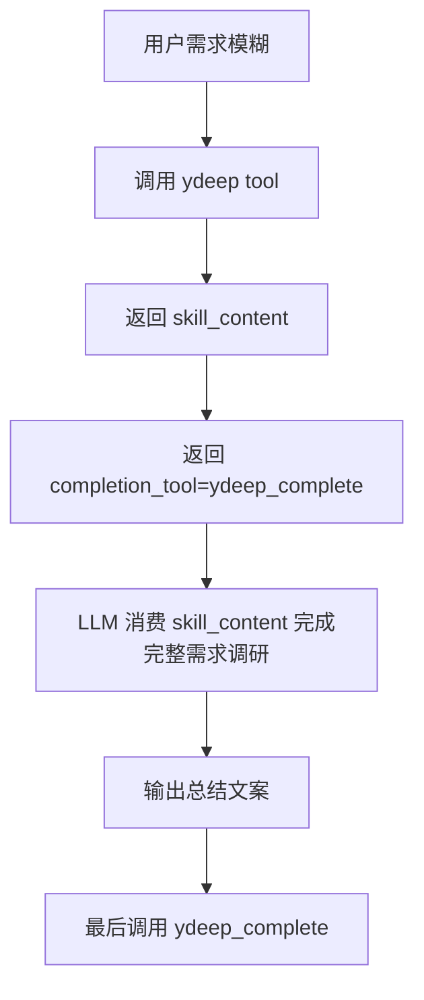
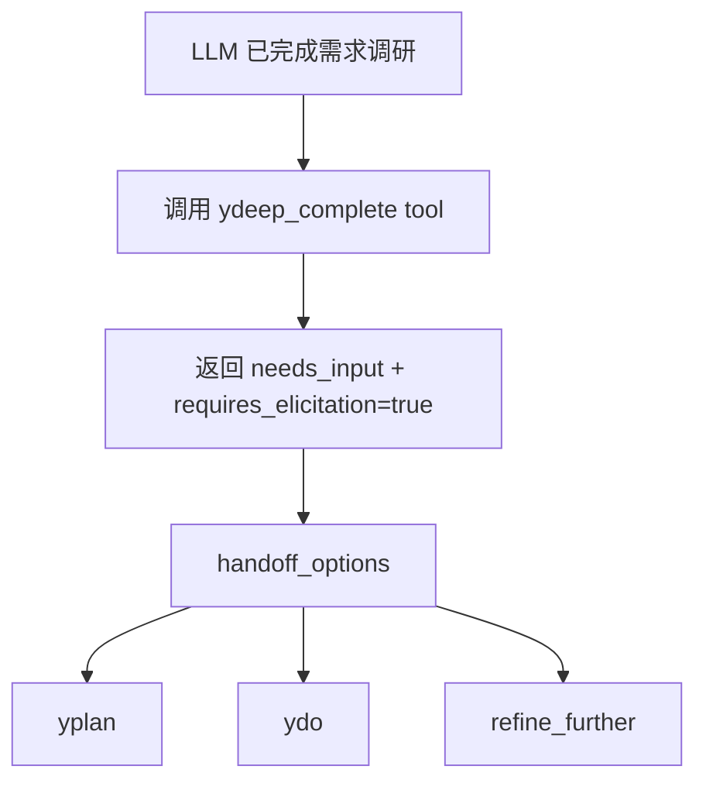
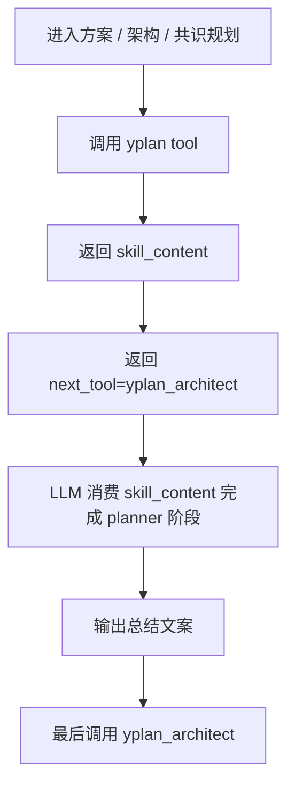
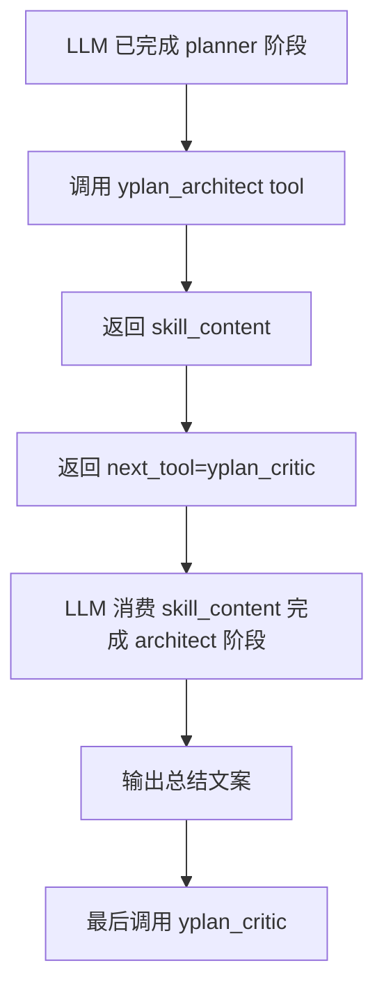
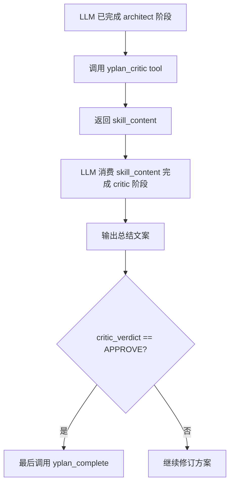
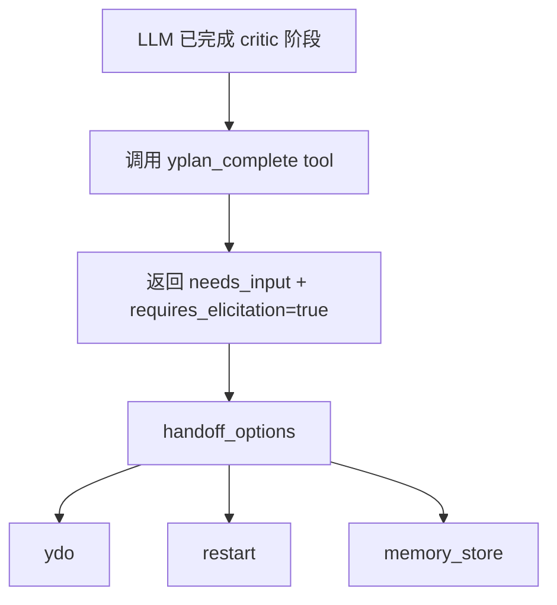
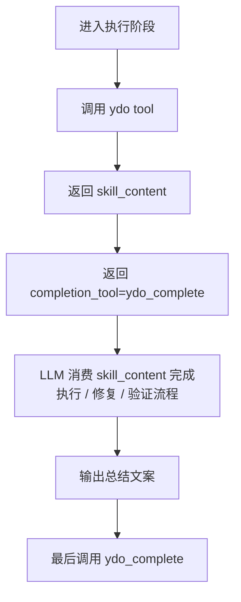
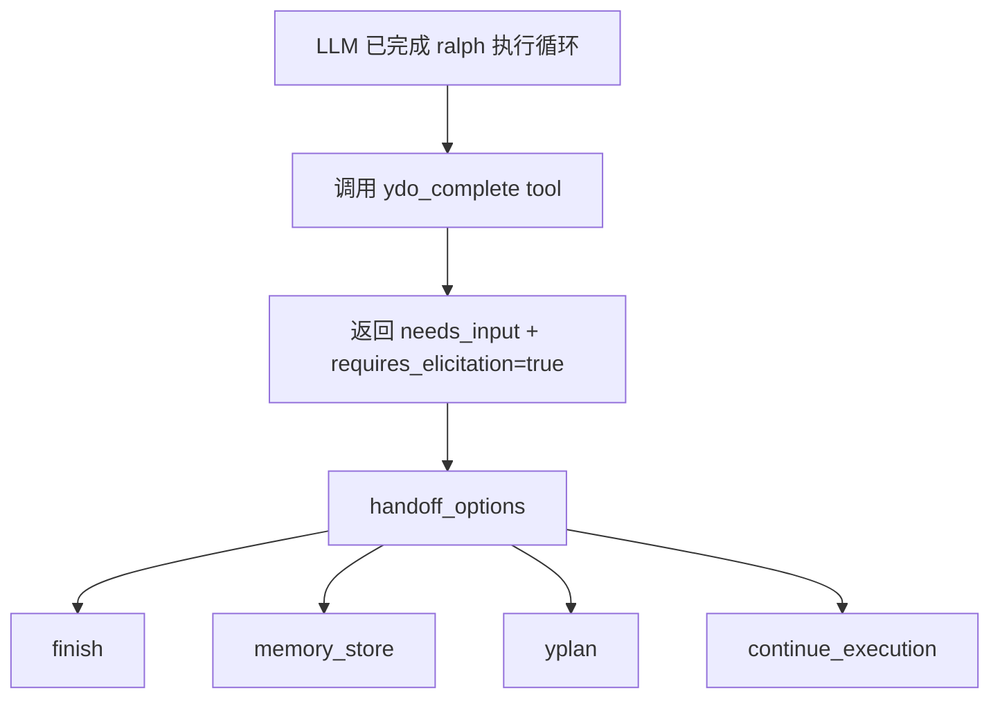
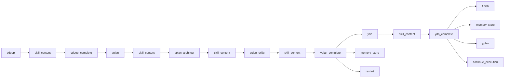

# 当前 MCP 工作流流程图

> 以下内容基于当前仓库实现：
>
> - workflow tools：`ydeep`、`ydeep_complete`、`yplan`、`yplan_architect`、`yplan_critic`、`yplan_complete`、`ydo`、`ydo_complete`
> - role / reasoning prompts：`deep-interview`、`planner`、`architect`、`critic`、`ralph`
> - tool 负责 **gate / handoff / Elicitation 约束**
> - LLM 负责 **内部思考与推进**

***

## 1. `ydeep` 当前流程

### 作用

- 启动需求澄清 workflow
- 直接返回当前阶段需要消费的 `skill_content`
- 在启动阶段同时给出收口入口 `ydeep_complete`

### 当前出口约束

- 调用 `ydeep` 后，LLM 应先消费返回的 `skill_content`
- 完成完整需求调研并输出总结文案后，最后必须调用 `ydeep_complete`

***

## 2. `ydeep_complete` 当前流程

### 作用

- 作为 `ydeep` 的专用结束工具
- 接收当前阶段总结文案
- 结束后由 tool 统一提供下一步 workflow 选项

### 当前出口约束

- `ydeep_complete` 调用后，必须由 tool 触发 **Elicitation** 提供下一步选项

***

## 3. `yplan` 当前流程

### 作用

- 启动共识规划 workflow
- 直接返回当前阶段需要消费的 `skill_content`
- 在启动阶段同时给出下一步入口 `yplan_architect`

### 当前出口约束

- 调用 `yplan` 后，LLM 应先消费返回的 `skill_content`
- 完成 planner 阶段并输出总结文案后，最后必须调用 `yplan_architect`

***

## 4. `yplan_architect` 当前流程

### 作用

- 承接 planner 阶段产物
- 直接返回当前阶段需要消费的 `skill_content`
- 在本阶段结束后把下一步固定为 `yplan_critic`

### 当前出口约束

- 调用 `yplan_architect` 后，LLM 应先消费返回的 `skill_content`
- 完成 architect 阶段并输出总结文案后，最后必须调用 `yplan_critic`

***

## 5. `yplan_critic` 当前流程

### 作用

- 承接 architect 阶段产物
- 直接返回当前阶段需要消费的 `skill_content`
- 作为共识规划的质量门，决定是否允许进入完成态交接

### 当前出口约束

- 调用 `yplan_critic` 后，LLM 应先消费返回的 `skill_content`
- 若 Critic 判定为 `APPROVE`，完成 critic 阶段并输出总结文案后，最后才允许调用 `yplan_complete`
- 若 Critic 判定为 `REVISE`，继续修订方案，不允许调用 `yplan_complete`

***

## 6. `yplan_complete` 当前流程

### 作用

- 作为 `yplan` 的专用结束工具
- 接收当前阶段总结文案
- 在共识规划结束后统一触发下一步 Elicitation
- 向用户展示执行、重开或记忆沉淀选项

### 当前出口约束

- 只有 Critic 判定为 `APPROVE` 时，`yplan_complete` 才能触发 **Elicitation** 提供下一步选项

***

## 7. `ydo` 当前流程

### 作用

- 启动执行验证 workflow
- 直接返回当前阶段需要消费的 `skill_content`
- 在启动阶段同时给出收口入口 `ydo_complete`

### 当前出口约束

- 调用 `ydo` 后，LLM 应先消费返回的 `skill_content`
- 完成执行 / 修复 / 验证流程并输出总结文案后，最后必须调用 `ydo_complete`

***

## 8. `ydo_complete` 当前流程

### 作用

- 作为 `ydo` 的专用结束工具
- 接收当前阶段总结文案
- 在执行阶段结束后统一触发下一步 Elicitation
- 向用户展示结束、记忆沉淀、回规划或继续增强选项

### 当前出口约束

- `ydo_complete` 调用后，必须由 tool 触发 **Elicitation** 提供下一步选项

***

## 9. 当前总关系图

***

## 10. 当前实现要点

### `ydeep`

- 输入核心：`brief`
- 输出核心：
  - `suggested_prompt=deep-interview`
  - `skill_content`
  - `completion_tool=ydeep_complete`
  - `readiness_verdict`

### `ydeep_complete`

- 输入核心：`brief`、`summary`
- 输出核心：
  - `suggested_prompt=deep-interview`
  - `received_summary`
  - `readiness_verdict`
  - `handoff_options`

### `yplan`

- 输入核心：`task`
- 输出核心：
  - `suggested_prompt=planner`
  - `skill_content`
  - `next_tool=yplan_architect`

### `yplan_architect`

- 输入核心：`task`、`plan_summary`、`planner_notes`
- 输出核心：
  - `suggested_prompt=architect`
  - `skill_content`
  - `next_tool=yplan_critic`

### `yplan_critic`

- 输入核心：`task`、`plan_summary`、`planner_notes`、`architect_notes`、`critic_verdict`、`critic_notes`
- 输出核心：
  - `suggested_prompt=critic`
  - `skill_content`
  - `critic_verdict`
  - `next_tool=yplan_complete`（仅 APPROVE 时）

### `yplan_complete`

- 输入核心：`task`、`summary`、`critic_verdict`、`plan_summary`、`planner_notes`、`architect_notes`、`critic_notes`、`acceptance_criteria`
- 输出核心：
  - `received_summary`
  - `critic_verdict`
  - `consensus_verdict=approved`（仅 APPROVE 时）
  - `handoff_options=[ydo, restart, memory_store]`

### `ydo`

- 输入核心：`approved_plan`
- 输出核心：
  - `suggested_prompt=ralph`
  - `skill_content`
  - `completion_tool=ydo_complete`

### `ydo_complete`

- 输入核心：`approved_plan`、`summary`
- 输出核心：
  - `received_summary`
  - `execution_verdict=complete`
  - `handoff_options=[finish, memory_store, yplan, continue_execution]`

***

## 11. 一句话总结

当前流程不是“tool 编排思考”，而是：

- **skill_content 负责思考输入**
- **tool 负责逐步发放 skill_content、串联阶段和下一步强约束**
- **Elicitation 只出现在 tool 判定完成后的关键流转点**
