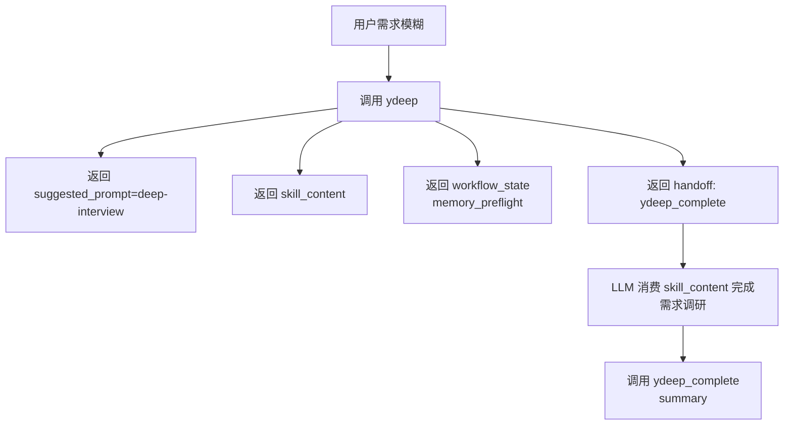
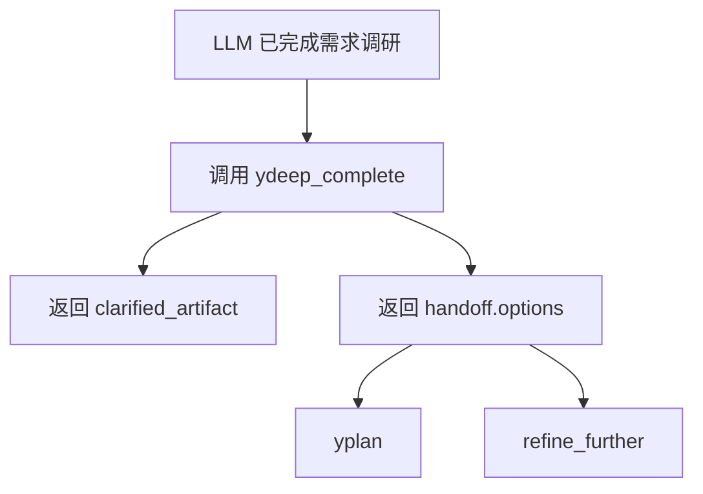
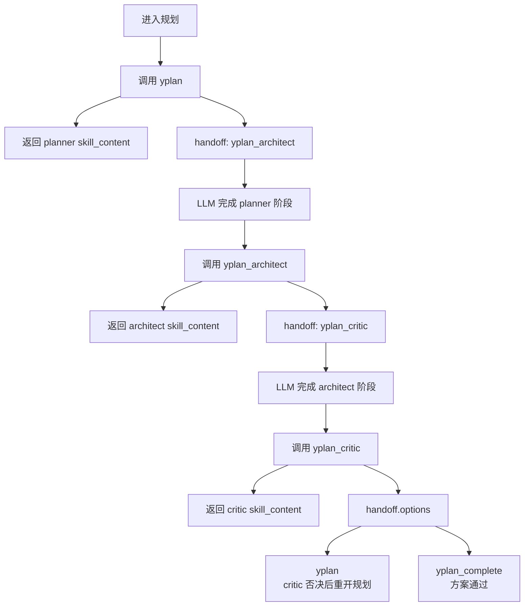
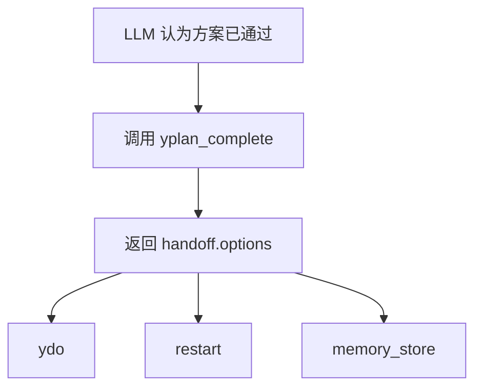
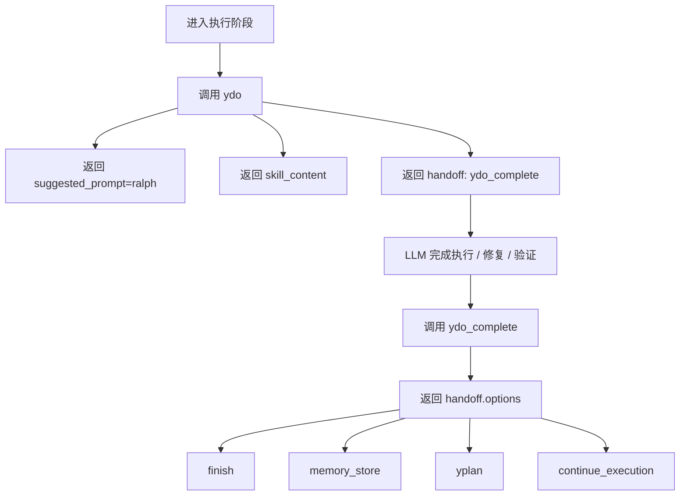

# 当前 MCP 工作流流程图

> 以下内容基于当前仓库实现（`src/ymcp/engine/*.py` 与 `tests/unit/test_engines.py`）：
>
> - workflow tools：`ydeep`、`ydeep_complete`、`yplan`、`yplan_architect`、`yplan_critic`、`yplan_complete`、`ydo`、`ydo_complete`
> - role / reasoning prompts：`deep-interview`、`planner`、`architect`、`critic`、`ralph`
> - tool 负责 **下发当前阶段 skill_content、声明合法下一跳；complete 阶段主要作为收口 gate**
> - LLM 负责 **持有同一调用链上下文、完成思考、选择合法下一步**

***

## 1. `ydeep` 当前流程

- `status=needs_input`，`required_host_action=await_input`
- `ydeep` 不要求回传中间 artifact
- 同一调用链内由 LLM 自己承接澄清上下文

***

## 2. `ydeep_complete` 当前流程

- `status=ok` 仅在 Elicitation 成功 accept 后成立；Elicitation unsupported / failed / invalid selection 时应返回 `blocked`；用户主动 decline / cancel 时可返回 `needs_input` 继续等待选择
- 只有收口阶段才产出 `clarified_artifact`
- `handoff.options` 是下一步动作的唯一权威源，应被理解为菜单项，而不是路由协议对象
- 宿主必须以 `handoff.options` 作为唯一权威菜单数据源，通过 Elicitation 或等价交互控件完整展示全部菜单项，并逐项提供标题与描述；不得省略、改写、新增；若宿主不支持 Elicitation 或调用失败，本阶段应返回 `blocked`，并进入“宿主必须用 handoff.options 渲染可交互菜单并等待用户选择”的兜底模式；不得退化为普通文本菜单、LLM 代选或自动继续

***

## 3. `yplan` / `yplan_architect` / `yplan_critic`

- `yplan` 只负责 planner 入口
- `yplan_architect` 只负责 architect 入口
- `yplan_critic` 只声明两个合法下一步：`yplan`、`yplan_complete`
- `yplan_critic` 否决时必须强制回到 `yplan`；不得继续停留在 critic 阶段，也不得回退到 architect 阶段
- 中间阶段不要求回传 `planning_artifact`、`planner_summary`、`architect_notes` 等结构化状态
- 同一调用链内由 LLM 自己承接规划上下文

***

## 4. `yplan_complete` 当前流程

- `status=ok` 仅在 Elicitation 成功 accept 后成立；Elicitation unsupported / failed / invalid selection 时应返回 `blocked`；用户主动 decline / cancel 时可返回 `needs_input` 继续等待选择
- `yplan_complete` 是无输入收口 gate
- 调用它本身就表示 LLM 认为 planning 阶段已结束
- 宿主必须以 `handoff.options` 作为唯一权威菜单数据源，通过 Elicitation 或等价交互控件完整展示全部菜单项，并逐项提供标题与描述；不得省略、改写、新增；若宿主不支持 Elicitation 或调用失败，本阶段应返回 `blocked`，并进入“宿主必须用 handoff.options 渲染可交互菜单并等待用户选择”的兜底模式；不得退化为普通文本菜单、LLM 代选或自动继续

***

## 5. `ydo` / `ydo_complete`

- `ydo` 不要求业务输入，直接依赖当前调用链上下文
- `ydo_complete` 是无输入收口 gate，只负责执行阶段收口与下一步选择
- `continue_execution` 表示继续当前执行循环，完成更多实现或验证后再回到 `ydo_complete`
- 宿主必须以 `handoff.options` 作为唯一权威菜单数据源，通过 Elicitation 或等价交互控件完整展示全部菜单项，并逐项提供标题与描述；不得省略、改写、新增；若宿主不支持 Elicitation 或调用失败，本阶段应返回 `blocked`，并进入“宿主必须用 handoff.options 渲染可交互菜单并等待用户选择”的兜底模式；不得退化为普通文本菜单、LLM 代选或自动继续

***

## 6. 总结

当前实现的核心边界是：

- **中间阶段只返回 skill 和下一跳**
- **同一调用链上下文由 LLM 自己承接**
- **complete 阶段本身就是阶段已结束的信号，不再要求回灌摘要输入**
- **tool 不替 LLM 编排思考，只限制合法流转**
