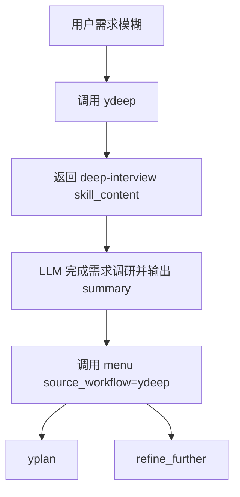
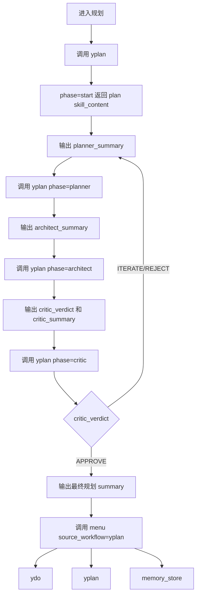
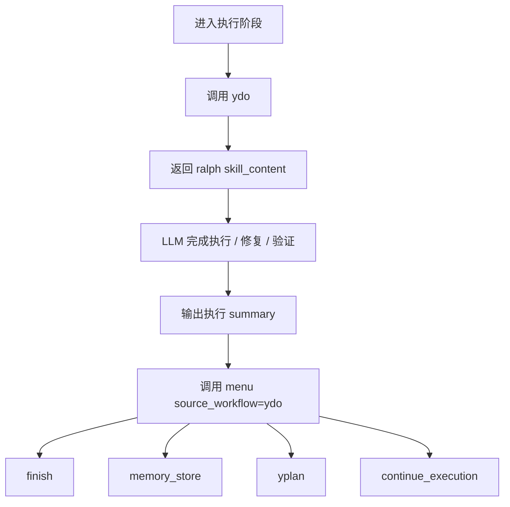

# 当前 MCP 工作流流程图

> 当前公开 workflow tools：`ydeep`、`yplan`、`ydo`、`menu`。
> `menu` 是唯一流程菜单 tool；优先 MCP Elicitation，失败时提供 localhost WebUI fallback。

***

## 1. `ydeep` → `menu`

## 2. `yplan` → `menu`

## 3. `ydo` → `menu`

## 4. `menu` fallback

- `handoff.options` 是下一步动作的唯一权威源。
- `menu` 优先调用 MCP Elicitation。
- Elicitation unsupported / failed / invalid / declined / cancelled 时，`menu` 返回 `blocked`，并在 `meta.ui_request.webui_url` 提供真实可交互 WebUI。
- WebUI 使用随机 token；只允许查看当前菜单和提交合法 option value。
- assistant 不得用普通文本或 markdown 列表代渲染菜单，也不得自动选择 recommended 项。
