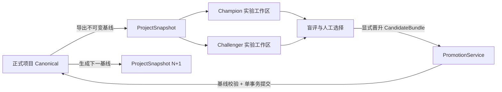
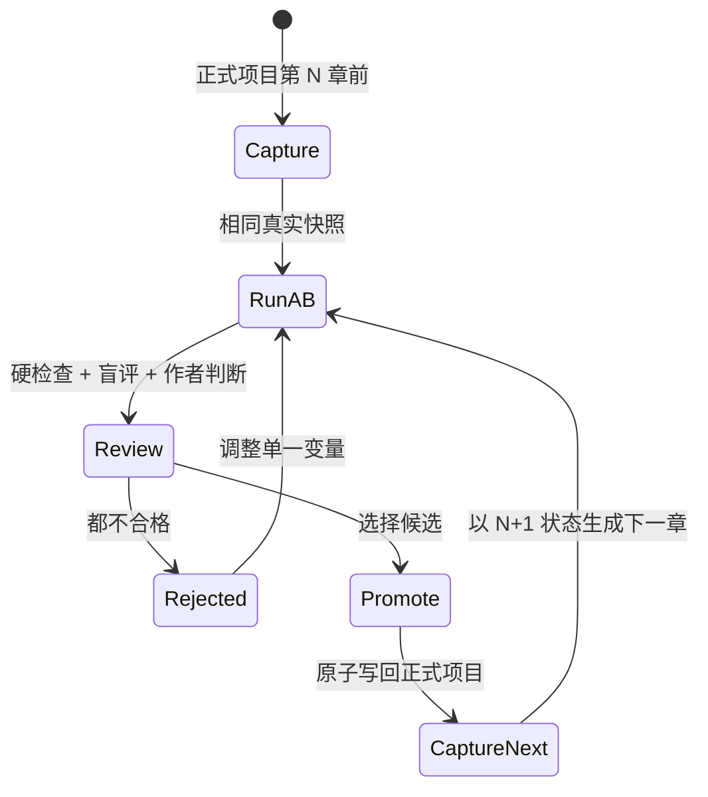

# 小说真实数据评测与同步架构

## 1. 目标

本架构用于在真实小说项目上持续运行章节生成、审稿、修订和事实提取，同时保证：

1. 正式项目是唯一真源，测试运行不能直接修改正式数据。
2. 测试可以完整复用某一时刻的真实项目状态，而不是人工拼装 fixture。
3. 测试期间正式项目继续发生变化时，系统能够识别实验已经过期。
4. 被作者选中的候选章节可以受控回写正式项目，并延续事实、记忆、时间线和伏笔状态。
5. 每一次优化都能追溯到输入快照、提示词、模型、代码版本、产物、评分和人工决定。

非目标：

- 不把测试库做成另一个可以长期独立编辑的正式项目。
- 不在正式项目与测试项目之间做字段级实时双向同步。
- 不自动把 LLM 评分最高的稿件写入正式项目。

## 2. 核心原则

### 2.1 正式数据单向进入实验，实验结果显式晋升

数据流只有两个方向：



测试工作区可以从正式项目刷新，但不会把运行中的中间状态持续同步回正式项目。只有一个完整、被作者接受的 `CandidateBundle` 可以晋升。

### 2.2 不采用同库克隆项目

当前小说模块大量直接依赖全局 `novelDb`。只复制一个新的 `projectId` 到同一个 IndexedDB，仍可能因为遗漏 `projectId` 过滤、全局查询、偏好信号或操作日志而污染正式数据。

实验必须使用物理隔离的数据库：

- 正式库：`ymcp-novel-db-v4`
- 浏览器实验库：`ymcp-novel-eval-v1-{experimentId}`
- Vitest：独立 `fake-indexeddb` 实例
- 文件产物：`.novel-bench/runs/{runId}`

实验副本保留正式记录的原始 ID，便于比较和生成晋升增量；隔离由数据库实例保证，而不是依赖改写所有 ID。

### 2.3 不做运行中热同步

如果实验创建后正式项目发生变化，实验状态标记为 `stale`。系统提供两个选择：

- 放弃旧实验，从最新正式快照重新运行。
- 保留旧实验仅用于历史比较，禁止晋升。

不对 LLM 正文进行自动三方合并。正文、人物状态和事实之间存在语义耦合，字段级合并无法证明叙事一致性。

## 3. 数据分层

### 3.1 正式项目数据

以下数据决定下一章的真实创作上下文，必须进入项目快照：

- 项目设置：`projects`、`architectures`
- 世界状态：`entities`、`relations`、`timelineEvents`
- 规划状态：`outlineNodes`、`scenes`、`plotThreads`、`foreshadowing`
- 正文状态：`documents`、已批准的 `revisions`
- 事实状态：`factAssertions`、`knowledgeAssertions`、`outlineRealizations`
- 记忆状态：有效的 `derivedMemories`、必要的 `snapshots`
- 作者上下文：仍生效的 `conversationMemories`
- 创作偏好：`projectSkills`、`tasteProfiles`、有效的 `preferenceSignals`

默认不复制旧的运行过程数据：

- `workflowRuns`
- `workflowArtifacts`
- `qualityReports`
- `factCandidates`
- `proposals`
- `agentRuns`
- `manuscriptChanges`
- `contextPackets`
- `retrievalRuns`
- `memoryJobs`

这些记录属于某次执行，不属于小说在基线时刻的既定事实。需要复盘历史运行时，作为独立 evidence 附件导出，不注入新实验数据库。

### 3.2 不可变项目快照

新增持久化格式 `ProjectSnapshotBundle`。它不同于当前 `StorySnapshot`：当前类型只记录故事状态摘要，不能还原完整项目。

```ts
interface ProjectSnapshotBundle {
  formatVersion: 3;
  snapshotId: string;
  sourceProjectId: string;
  sourceDatabaseVersion: number;
  createdAt: number;
  reason: "manual" | "chapter-baseline" | "post-promotion" | "replay";
  head: ProjectHead;
  records: Record<string, unknown[]>;
  manifest: SnapshotManifest;
}

interface ProjectHead {
  projectRevision: number;
  currentSnapshotId?: string;
  latestFinalDocumentId?: string;
  latestFinalDocumentOrder?: number;
  finalDocumentHeads: Array<{
    documentId: string;
    documentRevision: number;
    approvedRevisionId?: string;
    contentHash: string;
  }>;
}

interface SnapshotManifest {
  recordCounts: Record<string, number>;
  tableHashes: Record<string, string>;
  snapshotHash: string;
  schemaVersion: number;
}
```

`snapshotHash` 由规范化排序后的全部记录计算。导入后重新计算并校验，防止 fixture 不完整或手工修改后仍被误认为真实基线。

### 3.3 实验记录

```ts
interface NovelExperiment {
  id: string;
  sourceProjectId: string;
  baseSnapshotId: string;
  baseSnapshotHash: string;
  targetDocumentId: string;
  status: "created" | "running" | "ready" | "stale" | "promoted" | "rejected";
  variants: ExperimentVariant[];
  selectedCandidateId?: string;
}

interface ExperimentVariant {
  id: string;
  role: "champion" | "challenger";
  configFingerprint: string;
  model: string;
  temperature: number;
  codeRevision: string;
  promptFingerprint: string;
  workflowRunId?: string;
}
```

每个 variant 从相同 `ProjectSnapshotBundle` 创建自己的实验数据库。不能让 Champion 先提交事实后再让 Challenger 运行，否则两者输入已经不同。

### 3.4 可晋升候选包

测试数据库不能整体合并回正式数据库。它只能导出语义明确的 `CandidateBundle`：

```ts
interface CandidateBundle {
  formatVersion: 2;
  id: string;
  experimentId: string;
  variantId: string;
  sourceProjectId: string;
  baseSnapshotId: string;
  baseSnapshotHash: string;
  dependencyHead: ProjectHead;
  targetDocument: {
    documentId: string;
    baseRevision: number;
    baseApprovedRevisionId?: string;
    baseContentHash: string;
  };
  manuscript: {
    title: string;
    summary: string;
    plainText: string;
    contentHtml: string;
    wordCount: number;
    contentHash: string;
  };
  acceptedFacts: PromotableFact[];
  qualityEvidence: QualityEvidence;
  provenance: {
    model: string;
    promptFingerprint: string;
    configFingerprint: string;
    codeRevision: string;
    workflowArtifactIds: string[];
  };
}
```

`CandidateBundle` 不携带实验库生成的 revision ID、fact assertion ID、memory ID 或 operation ID。正式库在晋升事务中重新生成这些 ID 和来源关系。

## 4. 深模块与 seam

### 4.1 `ProjectSnapshotPort`

负责完整、确定性地导出和恢复真实项目状态。

```ts
interface ProjectSnapshotPort {
  capture(projectId: string, reason: SnapshotReason): Promise<ProjectSnapshotBundle>;
  restore(bundle: ProjectSnapshotBundle, target: NovelWorkspace): Promise<void>;
  verify(bundle: ProjectSnapshotBundle): SnapshotVerification;
}
```

实现内部负责表清单、记录排序、哈希、schema 迁移和引用完整性。调用方不应逐表复制。

### 4.2 `NovelWorkspace`

这是正式运行与实验运行共享的数据库 seam。

```ts
interface NovelWorkspace {
  readonly kind: "canonical" | "experiment";
  readonly workspaceId: string;
  runChapter(input: RunChapterInput): Promise<ChapterRunResult>;
  exportCandidate(runId: string): Promise<CandidateBundle>;
  close(): Promise<void>;
}
```

提供两个 adapter：

- `CanonicalNovelWorkspace`：连接正式 Dexie，只允许正常 UI 创作和晋升写入。
- `ExperimentNovelWorkspace`：连接隔离 Dexie，允许完整工作流自由写入。

工作流阶段不再直接 import 全局 `novelDb`，而是从 `StageContext.workspace` 获取其所需仓储。这是实现隔离必须完成的核心重构。

### 4.3 `RealProjectEvaluation`

对调用方提供一个小接口，隐藏快照、工作区创建、A/B 运行、产物收集和过期判断：

```ts
interface RealProjectEvaluation {
  create(input: CreateExperimentInput): Promise<NovelExperiment>;
  run(experimentId: string): Promise<ExperimentResult>;
  refresh(experimentId: string): Promise<NovelExperiment>;
  select(experimentId: string, candidateId: string): Promise<void>;
}
```

`refresh` 的语义是从最新正式状态创建新实验，不修改旧实验。旧实验仍可用于历史对比。

### 4.4 `PromotionService`

这是实验结果回到正式项目的唯一 seam：

```ts
interface PromotionService {
  inspect(candidate: CandidateBundle): Promise<PromotionCheck>;
  promote(candidate: CandidateBundle, decision: AuthorDecision): Promise<PromotionReceipt>;
}
```

其他代码不得从实验库向正式表执行 `bulkPut`。

## 5. 同步协议

### 5.1 创建实验

1. 暂停目标项目的新工作流启动，等待当前正式事务完成。
2. 在一个正式库只读事务中导出 `ProjectSnapshotBundle`。
3. 计算并保存 `snapshotHash` 与 `ProjectHead`。
4. 为 Champion 和 Challenger 创建两个物理隔离数据库。
5. 校验导入后的 hash、表计数和引用完整性。
6. 使用相同章节简报、蓝图约束和基线运行两个 variant。

### 5.2 检测正式数据变化

实验不轮询复制正文，而是比较依赖头：

- 目标章节的 `revision`、`approvedRevisionId`、`contentHash`
- 所有前置 final 章节的批准 revision
- 项目设置 revision
- 本次上下文实际引用的实体、关系、情节线、伏笔、时间线和事实 revision

任一依赖发生变化即把实验标记为 `stale`。未进入本次 context packet 的无关画布布局或聊天消息变化，不应阻止晋升。

### 5.3 晋升事务

`PromotionService.promote` 必须按以下顺序执行：

1. 校验候选包签名、项目 ID 和目标章节 ID。
2. 重算正式项目的 dependency head。
3. 若基线不一致，返回 `stale-baseline`，不写任何数据。
4. 校验正文 hash、确定性质量 blocker 和作者批准信息。
5. 在正式 Dexie 单事务内：
   - 创建新的 approved `DocumentRevision`；
   - 更新 `ManuscriptDocument` 正文、摘要、状态和 `approvedRevisionId`；
   - 以正式 revision 为来源提交已接受事实；
   - 更新 outline realization、人物状态、情节线、伏笔和时间线；
   - 创建章节记忆与正式 `StorySnapshot`；
   - 在作者明确接受后写入 `PreferenceSignal`；
   - 写入带 `candidateId` 的幂等 operation/receipt。
6. 事务完成后重新建立 embedding 等可再生索引。
7. 生成 `ProjectSnapshotBundle N+1`，作为下一章的真实基线。

晋升失败时，正式库保持原样。相同 `candidateId` 重试必须返回已有 receipt，不能重复创建事实或 revision。

### 5.4 冲突处理

| 情况 | 处理 |
| --- | --- |
| 正式项目未变化 | 允许晋升 |
| 仅无关 UI/画布数据变化 | 允许晋升 |
| 目标章节被人工编辑 | 拒绝，重新生成或人工比较 |
| 前置章节正文或事实变化 | 拒绝，从新快照重跑 |
| 项目提示词/技能变化 | 默认拒绝；可创建新 variant 重跑 |
| 后续未参与上下文的草稿变化 | 不影响当前候选 |
| 候选只修改正文一部分 | 仍按完整候选正文晋升，不做隐式段落合并 |

## 6. 推进真实小说的循环



每完成一章，正式项目真实推进一次；每次流程修改也会留下可比较的实验记录。为避免只对当前小说过拟合，发布流程优化前还应回放 2 至 3 个固定历史快照，但这些回放永远不能晋升。

## 7. 与现有代码的对应关系

现有能力可以复用：

- `WorkflowRun`、`WorkflowArtifact`、`QualityReport` 继续记录实验内部过程。
- `DocumentRevision.contentHash` 和 `ManuscriptChange.baseContentHash` 可作为乐观并发校验基础。
- `applyManuscriptChanges` 已具备正文基线检查，应下沉为晋升事务的一部分。
- `commitAcceptedFacts`、`createChapterMemory`、`createWorkflowSnapshot` 可复用其领域逻辑，但必须接受 workspace/repository，而不能固定写全局 `novelDb`。
- `.novel-bench/runs` 与 `compare.mjs` 继续承担历史证据和趋势比较。
- `fake-indexeddb` 继续用于自动测试，但测试输入改为真实项目快照，而不是只依赖手写 foundation fixture。

当前 `StorySnapshot` 不能代替完整项目快照；它只包含人物位置、活跃情节线和近期摘要。

## 8. 推荐目录

```text
src/features/novel/evaluation/
  index.ts                         # RealProjectEvaluation 的公共接口
  project-snapshot.ts              # 完整项目导出、恢复、校验
  experiment-workspace.ts          # 隔离 Dexie 生命周期
  candidate-bundle.ts              # 实验产物归一化
  dependency-head.ts               # 精确过期检测
  promotion.ts                     # 唯一正式回写入口
  evaluation-record.ts             # meta、metrics、evidence

src/features/novel/repository/
  novel-workspace.ts               # 工作流使用的窄接口
  dexie-workspace.ts               # 正式/实验共享 adapter

scripts/novel-bench/
  export-real-project.mjs
  run-real-project.mjs
  compare.mjs
```

## 9. 分阶段实施

### 阶段一：只读真实数据回放

- 实现完整项目快照格式、导出、校验和实验库恢复。
- bench 从真实快照运行，不允许任何回写正式库。
- 运行产物补齐 snapshot hash、代码版本、模型、提示词 hash 和成本。
- 用测试证明正式库运行前后 hash 完全一致。

验收条件：可以从一个真实项目生成候选章节，关闭进程后仍能复现输入；正式项目零变化。

### 阶段二：工作区注入

- 把章节工作流对全局 `novelDb` 的直接访问收敛到 `NovelWorkspace`。
- 同一套 workflow 在正式和实验两个 adapter 上运行。
- 增加 Champion/Challenger 同基线测试和 stale 检测。

验收条件：两个 variant 互不看见对方产生的 revision、事实、记忆和偏好信号。

### 阶段三：候选晋升

- 实现 `CandidateBundle`、预检、幂等 receipt 和正式库单事务晋升。
- 增加基线冲突、事务失败回滚、重复提交和事实来源完整性测试。
- 人工批准仍为强制步骤。

验收条件：接受一章后，正文、事实、记忆和快照同时推进；任何失败都不产生部分写入。

### 阶段四：产品化循环

- 在小说工作台显示实验状态、A/B 盲评、差异和成本。
- 提供“采用”“退回修订”“基于最新项目重跑”，不提供自动最高分晋升。
- 下一章默认使用最近一次成功晋升后生成的快照。

## 10. 必要测试

1. 快照往返：导出、恢复、再导出的 hash 相同。
2. 引用完整性：文档、revision、事实、记忆和 outline realization 没有悬空 ID。
3. 隔离性：实验完成后正式数据库所有表 hash 不变。
4. 同基线性：Champion/Challenger 的输入 snapshot hash、creative brief 和 context dependency head 相同。
5. 过期检测：修改正式目标章节或前置事实后，旧候选无法晋升。
6. 原子性：在晋升每个写入阶段注入失败，正式数据库均回到原状态。
7. 幂等性：同一 candidate 连续晋升两次只产生一个 revision 和一组事实。
8. 来源一致性：正式 fact assertion 的 `sourceRevisionId` 指向新批准 revision，而非实验 artifact。
9. 连续推进：第 N 章晋升后生成的新快照可以直接作为第 N+1 章输入。
10. 回放不可晋升：标记为 replay 的实验即使通过评分也不能写回正式项目。

## 11. 架构决策

最终采用：**物理隔离实验库 + 不可变完整快照 + 依赖头过期检测 + 候选包原子晋升**。

拒绝以下方案：

- 直接在正式 `projectId` 上跑测试后回滚：副作用分布在 revision、事实、记忆、偏好和操作日志，无法可靠清理。
- 同库复制一个测试 `projectId`：全局 `novelDb` 和遗漏过滤仍有污染风险。
- 正式/测试双向实时同步：会破坏实验可复现性，并产生无法自动解决的语义冲突。
- 整库合并实验结果：会把运行日志、临时 proposal、拒绝事实和实验 ID 带入正式项目。
