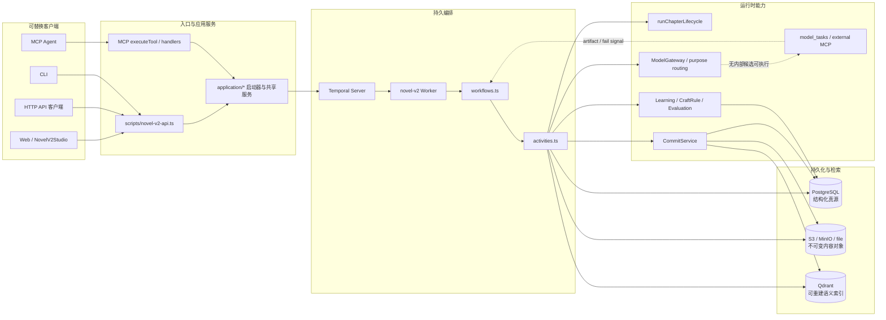
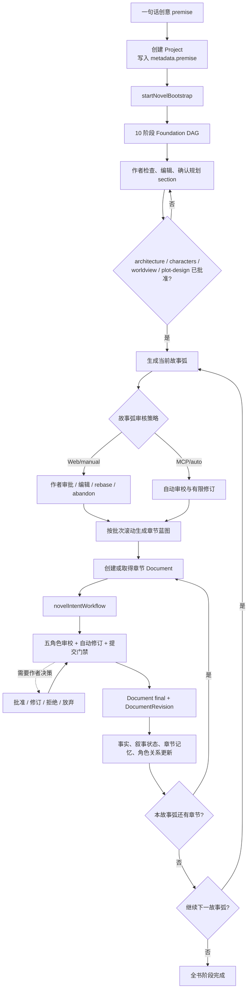
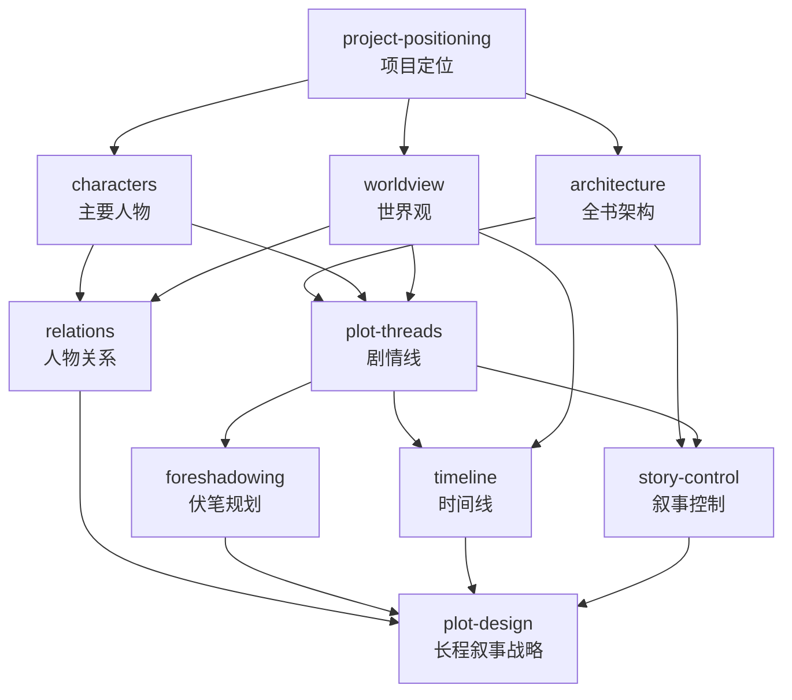
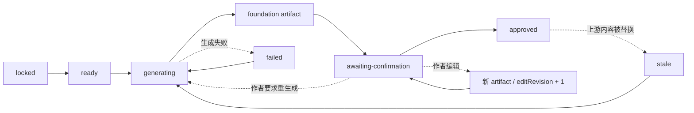
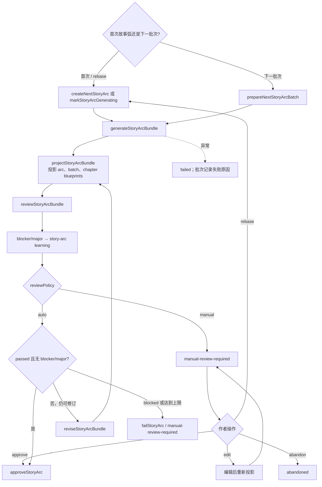
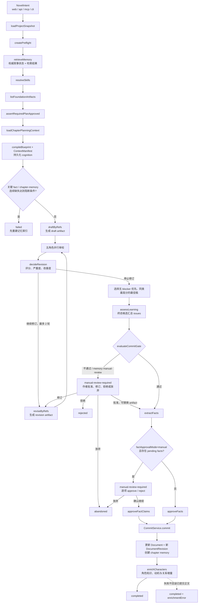
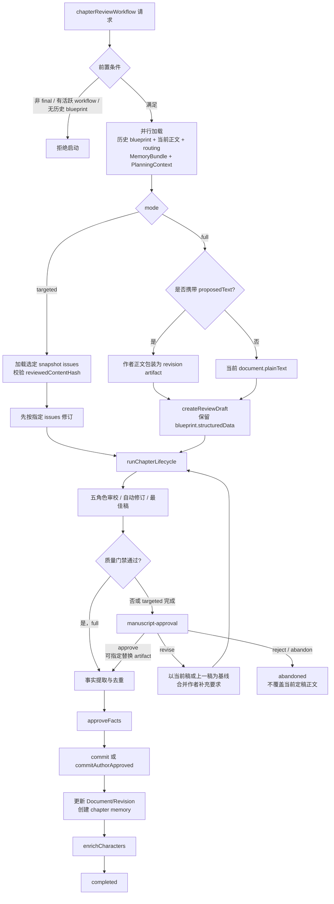
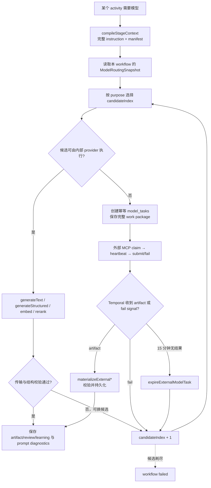
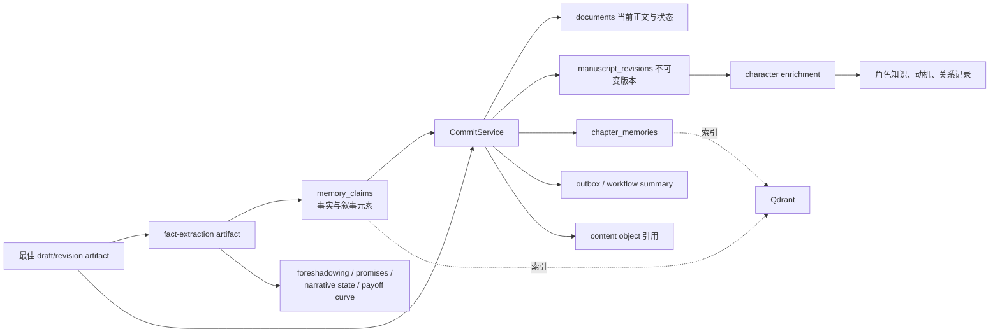
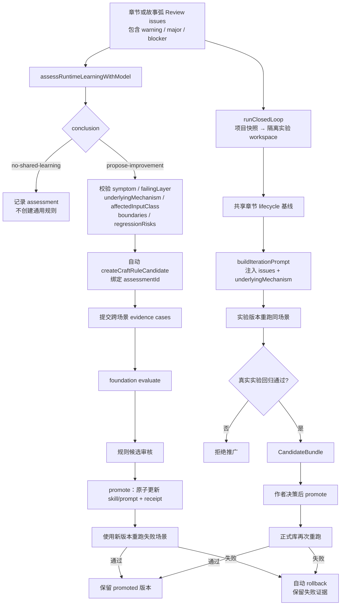

# Novel V2 小说创作工作流

> 梳理基线：2026-07-31 当前工作树，`HEAD=79986a9`。本文描述正在使用的 Novel V2 Runtime；工作树继续演进后，应按文末维护清单同步更新。

本文面向后续架构、提示词、创作质量与可观测性迭代，回答四个问题：创作请求从哪里进入、由谁持久编排、每个阶段消费和产出什么、失败或人工决策后如何继续。

相关资料：

- [Novel V2 Runtime](../novel-v2-runtime.md)：部署拓扑、环境变量和 HTTP 边界。
- [Novel MCP V2](../novel-mcp.md)：MCP 工具与调用契约。
- [流程质量审核报告](./pipeline-audit.md)：各阶段提示词、Schema 和产物质量审核；本文不重复其中的质量结论。
- [质量标准](./quality-standard.md)：创作产物与审校的评价基准。

## 1. 范围与阅读约定

- **当前主线**：PostgreSQL 是结构化真源，Temporal 持有长流程，正文与大对象通过对象存储保存，Qdrant 只承担可重建的语义索引。
- **客户端边界**：Web、HTTP、MCP、CLI 都是可替换客户端；正式正文不能由客户端绕过 Runtime 直接写入。
- **V1 边界**：旧 `/v1/projects`、`novelRuntimeClient`、SQLite Runtime 和旧 NovelStudio 不属于当前兼容目标。
- **图中实线**表示当前生产路径，**虚线**表示可选路径、人工路径、失败回退或兼容分支。
- `CreativeRun` 负责 Foundation 与通用 work item 编排；正式章节生成仍由 `novelIntentWorkflow` 和共享章节生命周期负责，不存在第二套章节生成实现。

## 2. 系统总览

### 2.1 入口矩阵

| 用户意图 | Web / HTTP 入口 | MCP 入口 | 应用服务 / Temporal workflow | 主要结果 |
| --- | --- | --- | --- | --- |
| 一句话创建小说 | `POST /v2/projects` | `novel_project_create` | `startNovelBootstrap` → `creativeRunWorkflow` | 项目、10 阶段宏观规划 run |
| 已有项目启动规划 | `POST /v2/projects/:id/bootstrap` | `novel_bootstrap_run` | `startNovelBootstrap` → `creativeRunWorkflow` | Foundation work items 与规划 section |
| 生成/扩展故事弧 | `POST /v2/projects/:id/story-arcs/next`、`.../batches/next` | `novel_story_arc_start` | `startStoryArcPlanning` → `storyArcPlanningWorkflow` | 故事弧、滚动批次、章节蓝图与规划上下文 |
| 生成章节 | `POST /v2/intents` | `novel_chapter_generate` | `novelIntentWorkflow` | 定稿正文、事实、修订、章节记忆 |
| 重审已定稿章节 | `POST /v2/projects/:id/documents/:documentId/review` | `novel_chapter_review` | `chapterReviewWorkflow` | 新修订或保留原稿、更新事实与记忆 |
| 查询运行 | `GET /v2/runs/:workflowId` | `novel_workflow_get/list` | 读取 `workflow_runs`，必要时查询 Temporal | 当前状态、阶段、产物与诊断 |
| 运行改进闭环 | `POST /v2/projects/:id/closed-loop` | `novel_closed_loop_run` | `runClosedLoop` | 实验、候选、回归、推广或回滚 |

MCP server 直接调用 `executeTool`，不是 HTTP 代理；HTTP 与 MCP 最终必须汇入相同的应用服务、Temporal workflow 和正式提交边界。

## 3. 作者主流程

`chapter-plan` 入参仅为旧客户端兼容，当前 bootstrap 固定不生成静态全书章节表。章节方案由故事弧按批次滚动生成，避免在创作早期冻结整部长篇。

## 4. Foundation 全书规划

### 4.1 任务依赖图

### 4.2 单个规划阶段生命周期

关键逻辑：

1. `startNovelBootstrap` 创建一个 `CreativeRun`，按 DAG 建立 `CreativeWorkItem.dependsOn`，并初始化 `project_plan_sections`。
2. `creativeRunWorkflow` 自动或按用户信号选择可执行 work item；同一层可并行，依赖未满足的阶段保持锁定。
3. `generateFoundationWork` 使用 `planning.foundation` 模型目的生成结构化 artifact；无内部模型时创建外部任务等待回填。
4. bootstrap 默认 `reviewGate=none`，CreativeRun 可完成，但 Web 规划 section 仍通过独立的作者确认状态表达正式批准。
5. 编辑或重生成上游 section 时，`transitivePlanDependents` 界定需要重新检查的下游范围。
6. 正文创作的最低前置门禁是 `architecture`、`characters`、`worldview`、`plot-design` 全部为 `approved`；其他规划仍会作为可用 Foundation 上下文参与创作。
7. Foundation artifact 在记忆检索前被投影为 Foundation memory claims；PostgreSQL 写入成功但 Qdrant 更新失败时，索引可后续重建。

## 5. 滚动故事弧与章节蓝图

- Web 默认 `manual`，MCP 默认 `auto`；调用方可以显式选择策略。
- 自动策略最多修订两次。通过后才自动批准；被阻塞或达到上限时保留产物并转人工处理。
- 故事弧 bundle 同时携带批次位置与章节蓝图。外部修订结果不得改写当前 `batchIndex` 或 `startChapterIndex`。
- `ChapterPlanningContext` 将故事弧的起始状态、长线约束和章节位置冻结到具体 blueprint，供后续 draft/review/revision 使用。

## 6. 正式章节生成

### 6.1 `novelIntentWorkflow` 详细流程

### 6.2 上下文冻结与传递

1. `PreflightPlan` 根据目标章节、叙事截止点、POV 和任务类别声明检索 facet。
2. `retrieveMemory` 先修复 Foundation claims，再组合 PostgreSQL 权威叙事状态、开放伏笔/承诺、词法/语义检索结果；token budget 会随任务类别和章节规模调整。
3. `SkillBundle` 在 blueprint 编译前解析，记录实际 skill 版本、能力、冲突和缺失项。
4. `compileBlueprint` 同时持久化 `PreflightPlan`、`MemoryBundle`、`SkillBundle`、`ExecutionBlueprint`、`ContextManifest` 与路由快照相关引用。
5. 新工作流优先用 `draftByRefs/reviewByRefs/reviseByRefs` 传递 ID；activity 在执行边界加载不可变快照，减少 Temporal history 载荷并保持同轮上下文一致。
6. Prompt 由 `compileStageContext` 生成 `StagePromptPackage`，诊断记录保存 purpose、manifest/fingerprint、模型路由和对象快照引用。

### 6.3 五角色审校与质量门禁

| 角色 | identity | 主要职责 |
| --- | --- | --- |
| `plot-reviewer` | `internal` | 章节目标、情节因果、节奏、长线承诺与推进 |
| `continuity-reviewer` | `internal` | 事实、时间、位置、人物知识、POV、世界规则连续性 |
| `style-reviewer` | `independent` | 场景呈现、语言具体性、文风与幽默 |
| `character-reviewer` | `independent` | 人物声部、动机、选择和关系发展 |
| `reader-reviewer` | `independent` | 追更体验、章节功能、卖点兑现、爽点与感情线 |

当前决策常量：

| 常量 | 当前值 | 作用 |
| --- | --- | --- |
| `DEFAULT_MAX_AUTO_REVISIONS` | `2` | 自动修订最大轮数 |
| `MIN_IMPROVEMENT_THRESHOLD` | `0.15` | 连续修订改善不足时停止循环 |
| `MIN_AUTOMATIC_COMMIT_SCORE` | `4.0 / 5` | 自动提交综合分门槛 |
| `MIN_REVIEWER_SCORE` | `3.5 / 5` | 任一必需 reviewer 的最低分 |

自动提交还要求五个必需 reviewer 都绑定当前 artifact fingerprint、全部 `passed`，并且不存在 blocker/major。若修订降低质量，系统按“无 blocker 优先，其次同类分数更高”回退到本轮最佳稿。

`blueprint-approval` 和 `deterministic-check` 仍存在于共享阶段类型/展示元数据中，但当前 `novelIntentWorkflow` 没有独立的人工作流等待点：上游规划/故事弧审批提供 blueprint 的作者控制，writer self-check 已并入当前生成提示词与正式 reviewer 闭环。

## 7. 已定稿章节重审与定向修复

重审链路的关键不变量：

- 只处理 `document.status === "final"`，并拒绝与同章节活跃 workflow 并发。
- 不重新运行 context、blueprint、blueprint-approval 或初次 draft；历史 blueprint 的完整 `structuredData` 与当前定稿正文被包装成新 draft artifact。
- 完整重审可以从当前正文或作者提交稿开始；定向修复只能基于当前已保存正文和选中的有效 review issues。
- 保存于审核面板的作者编辑稿会替换本轮 `workflow_runs.payload.artifactId`；后续审批、事实提取和提交都使用替换后的 artifact。
- 定向修复完成后必经作者 manuscript approval；完整重审若质量门禁直接通过，可以自动提交。
- 事实提取使用 novelty/身份与来源边界去重，不能因“只是重审”跳过 facts、commit、chapter memory 或 character enrichment。

## 8. 模型路由与 external-MCP 分支

- 路由按 `ModelPurpose`，不按模块硬编码 provider；一次 workflow 使用冻结的 routing snapshot。
- 外部任务 ID 由 workflow、task、candidate 和输入 fingerprint 决定，重复执行不会创建不同语义的同一任务。
- Web Chat 类 API 接收一份完整 instruction；上下文在 Runtime 内编译，不拆成依赖远端会话记忆的多段提交。
- 外部 prompt diagnostics 是尽力而为记录，诊断写入失败不能阻塞真实 workflow signal。
- 每次候选失败或超时都推进 `candidateIndex`；候选全部耗尽才将所属阶段/工作流置为失败。

## 9. 提交、事实与记忆回写

### 9.1 核心产物与真源

| 数据/产物 | 主要真源 | 作用与约束 |
| --- | --- | --- |
| `workflow_runs`、`task_attempts`、events/outbox | PostgreSQL；Temporal 持运行历史 | UI 与客户端查询状态，`workflow_runs.id` 与 Temporal workflowId 对齐 |
| `PreflightPlan`、`MemoryBundle`、`SkillBundle`、`ExecutionBlueprint`、`ContextManifest` | PostgreSQL | 冻结一次创作运行的认知输入与来源 |
| `Artifact` 元数据 | PostgreSQL | 指向不可变内容对象，携带 fingerprint、baseRevision、task/attempt |
| 正文、prompt/response snapshot 等大对象 | S3/MinIO 或显式 file backend | 数据库保存 object key/hash；backend identity 与数据库绑定并 fail-closed |
| `manuscript_documents`、`manuscript_revisions` | PostgreSQL | 当前定稿投影与不可变版本历史；在领域层对应 Document/DocumentRevision，正式更新必须经过 `CommitService` |
| `memory_claims`、叙事状态、伏笔、承诺、爽点 | PostgreSQL | 权威记忆和叙事账本，带来源、叙事顺序和生命周期 |
| `chapter_memories` | PostgreSQL | 章节级压缩记忆，绑定 document revision |
| 语义向量 | Qdrant | 辅助召回；不是事实真源，可由 PostgreSQL 重建 |
| `learning_assessments`、`craft_rule_candidates`、receipts | PostgreSQL | 审核经验、改进候选、推广与回滚证据 |
| `prompt_executions` | PostgreSQL + 对象存储快照 | 记录实际 prompt manifest、路由、响应与到期信息 |

## 10. Learning、Skill 与提示词迭代闭环

闭环边界：

1. 所有 review issue 都进入 learning 证据；warning 只有形成持续模式时才应提升为共享改进。
2. `propose-improvement` 必须说明底层机制和受影响输入类，不能只复述某一章的症状。
3. `recordLearning` 在 assessment 落库后立即构造幂等 CraftRule candidate，不能只发送事件而不形成候选。
4. Skill 迭代 prompt 使用数据库中真实 skill ID，并包含 `underlyingMechanism`；缺少机制时不得臆造通用规则。
5. CraftRule 和通用 evaluation 使用不同的 promotion service，但都要求可审计 receipt、回归验证与失败回滚。
6. 推广依据不是单一 A/B 分数，而是同失败场景的实际重跑；跨题材规则还应覆盖一个实质不同的反例或场景。

## 11. 状态、人工门禁与失败出口

### 11.1 Workflow run 状态

| 状态 | 含义 | 典型下一步 |
| --- | --- | --- |
| `accepted` / `pending` | 已持久化并准备由 Temporal 执行 | Worker 开始后进入 `running` |
| `running` | activity、模型调用或修订循环执行中 | 继续轮询 events/artifacts/prompt executions |
| `waiting-external` | 专用 workflow 正等待 external-MCP 回填 | 外部客户端 claim/submit/fail |
| `manual-review-required` | 等待作者 manuscript、fact、story-arc 或 plan 决策 | Web/MCP 发 signal 或正式操作 |
| `completed` / `succeeded` | 流程完成，产物已按相应契约持久化 | 查看正文、版本、事实与学习结果 |
| `rejected` | 作者拒绝本轮章节候选 | 保留已有正式正文，不提交候选 |
| `abandoned` | 作者放弃本轮运行 | 终止当前候选链，保留原定稿 |
| `failed` | 不可恢复异常或候选耗尽 | 从 payload/error、events 和 prompt diagnostics 定位失败层 |
| `cancelled` | 用户取消运行 | 取消 Temporal，并过期所属 model tasks |

### 11.2 人工门禁

| 门禁 | 触发条件 | 允许操作 | 继续后的路径 |
| --- | --- | --- | --- |
| 规划 section 确认 | Foundation artifact 生成完成 | 编辑、重生成、批准 | 解锁依赖或标记下游 stale |
| 故事弧审批 | Web/manual 策略或 auto 未通过 | approve、edit、rebase、abandon | 批准后供章节滚动规划使用 |
| Manuscript approval | 质量门禁未通过、记忆需人工确认、定向修复完成 | approve、revise、reject、abandon；可先替换本轮 artifact | facts → commit，或回到 revision |
| Fact approval | `factApprovalMode=manual` 且存在 pending claims | 逐项 approve/reject，再确认继续；或放弃 | 批准 claims 后 commit |
| CraftRule review | 候选已具备 evidence/foundation 评估 | review、promote、reject/rollback | 推广后必须回归验证 |

## 12. 当前兼容分支与非主路径

- `chapter-context-refs-v1`、`chapter-review-context-refs-v1`：新运行通过 ID 引用冻结上下文；旧 Temporal history 仍能重放传完整对象的分支。
- `chapter-context-convergence-v1`、`chapter-review-context-convergence-v1`：新运行在终态候选汇总 learning；旧运行可能在各阶段评估并保留独立 reflection。
- 独立 `reflectOnDraft` 仅供旧 history 兼容。新运行依赖 writer self-check 与五角色正式审校，不应再把 reflection 设计成第二套提交证据。
- `chapter-targeted-revision-first-v1`：新定向修复先修订再正式审核；旧 history 可保持“先审核再定向修订”的确定性顺序。
- `blueprint-approval`、`deterministic-check` 是共享协议/UI 阶段标识，当前主 workflow 没有对应的独立人工等待 activity。
- 通用 `CreativeRun` 页面和 command router 可用于实验或 work item 管理；不能绕过 `novelIntentWorkflow`/`chapterReviewWorkflow` 直接改写正式章节。

## 13. 后续优化观察点

这些是应持续观察的系统边界，不是针对单个样例的修复清单：

| 观察点 | 需要持续回答的问题 | 建议证据 |
| --- | --- | --- |
| 上下文冻结与复用 | 同一轮 draft/review/revision 是否使用同一 Blueprint、Memory、Skill、PlanningContext 和路由快照；重复运行是否只在源变更时重算 | context/prompt fingerprint、artifact refs、retrieval run、Temporal history |
| 规划到正文的消费 | Foundation 与故事弧字段是否真的进入 blueprint/prompt，而非只存在数据库或 UI | `ContextManifest`、prompt snapshot、生成正文中的约束兑现 |
| 人工门禁可达性 | `manual-review-required` 是否在当前工作流视图直接提供决策；替换稿和决策是否绑定同一 artifact | workflow payload、UI 状态推导、signal 记录 |
| 幂等与并发 | project/bootstrap/intent/commit/review replacement 是否在重试、刷新和重复 signal 下保持单一结果 | idempotency key、workflowId、baseRevision、fingerprint、唯一约束 |
| 记忆覆盖与叙事顺序 | 检索失败、索引延迟、重审旧章节或改写事实时，是否会泄漏未来信息或保留孤儿 claims | narrative cutoff、source revision、claim lifecycle、memory gate |
| 模型降级 | 内部候选、外部 MCP、超时与候选切换是否保持相同 Schema、完整上下文和可诊断性 | model task、candidateIndex、prompt execution、materialize 校验 |
| 审校与修订收敛 | 阈值是否覆盖广泛章节功能；最佳稿回退是否避免分数改善但 blocker 回归，或 blocker 消失但总分波动 | 五角色原始 Review、每轮 score/issue、最终 artifact fingerprint |
| Learning 闭环 | issue 是否归因到最低共享层；候选是否覆盖受影响输入类并明确边界；推广后是否真实重跑失败场景 | learning assessment、candidate scope、evidence cases、receipt、回归产物 |
| 可观测性 | UI 的当前阶段是否来自真实 payload/events/artifacts；诊断过期后是否仍保留 manifest/fingerprint | workflow summaries、outbox、prompt execution retention |

改进时应先记录：观察症状、失败层、底层机制、受影响输入类、行为边界和回归风险；验证原失败场景以及至少一个实质不同的反例。提示词样例只能说明原则，不能成为标题、题材、角色名、章节号或固定短语的特判。

## 14. 源码索引

| 主题 | 主要实现 |
| --- | --- |
| Temporal 主流程、故事弧、CreativeRun、章节重审 | [`src/novel-v2/temporal/workflows.ts`](../../src/novel-v2/temporal/workflows.ts) |
| Workflow activities、模型物化、learning 自动 propose | [`src/novel-v2/temporal/activities.ts`](../../src/novel-v2/temporal/activities.ts) |
| 共享章节审校/修订/提交生命周期 | [`src/novel-v2/application/chapter-lifecycle.ts`](../../src/novel-v2/application/chapter-lifecycle.ts) |
| Foundation DAG 与正文前置规划门禁 | [`src/novel-v2/application/project-plan.ts`](../../src/novel-v2/application/project-plan.ts) |
| Bootstrap 与 CreativeRun 创建 | [`src/novel-v2/application/bootstrap.ts`](../../src/novel-v2/application/bootstrap.ts) |
| 故事弧启动服务 | [`src/novel-v2/application/story-arc-workflow.ts`](../../src/novel-v2/application/story-arc-workflow.ts) |
| 五角色、分数和修订阈值 | [`src/novel-v2/temporal/revision-policy.ts`](../../src/novel-v2/temporal/revision-policy.ts) |
| Learning 结构、机制分析与提示词 | [`src/novel-v2/learning-assessment.ts`](../../src/novel-v2/learning-assessment.ts) |
| CraftRule promote / regression / rollback | [`src/novel-v2/craft-rule/index.ts`](../../src/novel-v2/craft-rule/index.ts) |
| 隔离实验闭环 | [`src/novel-v2/evaluation/closed-loop.ts`](../../src/novel-v2/evaluation/closed-loop.ts) |
| HTTP 入口和 signal 路由 | [`scripts/novel-v2-api.ts`](../../scripts/novel-v2-api.ts) |
| MCP 工具入口 | [`src/novel-v2/mcp/handlers.ts`](../../src/novel-v2/mcp/handlers.ts) |
| Web 章节工作台和阶段展示 | [`src/pages/novel-v2/NovelPipelineBoard.tsx`](../../src/pages/novel-v2/NovelPipelineBoard.tsx) |

## 15. 文档维护清单

以下变更发生时必须同步更新本文：

1. 新增、删除或重排 Temporal workflow/activity/stage。
2. Foundation DAG、必需批准 section 或故事弧批次策略改变。
3. reviewer 角色、identity、评分门槛、修订轮数或最佳稿规则改变。
4. manuscript/fact approval 的触发条件、signal payload 或作者操作改变。
5. Artifact、DocumentRevision、fact、chapter memory、character enrichment 的提交顺序改变。
6. ModelPurpose、路由候选、external-MCP 超时/重试协议改变。
7. Learning candidate、promotion、回归验证或 rollback 契约改变。
8. PostgreSQL、对象存储、Qdrant 的真源边界改变。

维护时至少对照正式章节生成、已定稿重审、故事弧和 learning 四条链路，确认每条图都包含入口、人工门禁、失败出口和最终持久化结果。
